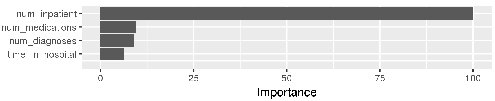

\maketitle
\thispagestyle{fancy}
^1^Department of Computer Science and Numerical Analysis, University of Córdoba, 14071 Córdoba, Spain. ^2^Knowledge Discovery and Intelligent Systems in Biomedicine Laboratory, Maimonides Biomedical Research Institute of Córdoba, 14004 Córdoba, Spain. ^3^Faculty of Computing and
Information Technology, King Abdulaziz University, Jeddah, Saudi Arabia. ^4^Department of Medicine, Virginia Commonwealth University, Richmond, VA 23298, USA. ^4^Department of Computer Science, Virginia Commonwealth University, Richmond, VA 23284, USA. ^5^IITiS Polish Academy of Sciences, 44-100 Gliwice, Poland.

Background & Summary
====================

Payment penalties based on the quality of care metrics has implied
continuous substantial changes in the business models of the healthcare
systems [@Futoma2015]. For example, the early readmission penalties
regulated in various countries have provoked the need of reliable
patient-care strategies that allow hospital systems identify, at the
time of discharge, those patients who are at high risk of being
readmitted within a short period of time (typically within 30 days after
the original admission) [@Leppin2014; @Verhaegh2014; @Golmohammadi2016].
In this same context, diabetes is nowadays a major health problem of
prevalence in developed countries, wherein patients commonly suffer
cardiovascular and other systemic complications, producing high
morbidity and mortality rates [@Gahete2018]. Accordingly, the problem of
minimizing the early readmissions of diabetic patients has gained an
increasing attention in the last years [@Leppin2014; @Strack2014],
considering the growing number of persons with diabetes type II, and the
large proportion of healthcare resources that this illness consumes.

The aforementioned necessity has lead to several works and datasets
focusing on studying the early readmission of diabetic patients. For
example, Jiang et al. [@Jiang2003] studied how the demographic and
socioeconomic factors could have a relevant influence on readmission
rates. Garrison et al. [@Garrison2005] described the impact of
psychiatric comorbidities on readmissions in youth. Dugan [@Dungan2012]
analyzed several general measures and diabetes-specific interventions to
prevent the readmissions. Healy et al. [@Healy2013] explored the
relationship between inpatient diabetes education and hospital
readmissions in patients with poorly controlled diabetes. Eby et
al. [@Eby2014] studied the readmission risk on a dataset of more than
52,000 patients, and they showed the importance of the escalation of
diabetic treatments, especially those escalated from having no records
of anti-diabetic medications to treatment with insulin. Rubin [@Rubin2015] determined that inpatient education, better discharge instructions, coordination of care and post-discharge support are potential ways to reduce readmission risk. Finally, Rubin et al. [@Rubin2016] developed and validated a tool on a cohort of 44,203 records that predicts readmission risk of diabetic patients, and later they further assessed their study in [@Rubin2017], where a cohort of 8,189 records of diabetic patients with cardiovascular disease was analyzed.

In this work, a large and potential dataset focusing in the early
readmission of diabetic patients problem is described and analyzed. This
dataset was extracted from the HIPAA-compliant Health Facts database
(Cerner Corporation, Kansas City, MO), collecting clinical records from
130 hospitals throughout the U.S.A. The database comprises data
systematically collected from electronic medical records and includes a
wide variety of elements, such as encounter records, demographic data,
diagnoses and in-hospital procedures documented by ICD9 codes, pharmacy
data, in-hospital mortality and hospital features. All data were
de-identified in compliance with the *Health Insurance Portability and
Accountability Act* of 1996 before being provided to the investigators.

An early version of this dataset was previously presented and analyzed
by our team in [@Strack2014], but at that time the dataset only
contained 70,000 records of diabetic patients, and that study aimed at
examining the relevance of HbA1C measurements, by conducting simple
statistical analysis, to improve patient outcomes and decrease
readmission frequencies. In this work, however, the dataset is expanded
to 101,766 records, and an extensive description of the properties, data
relationships and complexity of this dataset is provided. Therefore,
this work presents a further description of the characteristics of this
large data collection, allowing to characterize the difficulty of this
dataset in conducting an automatic classification task; the prediction
task consist on estimating whether a patient will be readmitted to the
hospital in 30 days or less. The study was carried out first by means of
conducting a data description and analysis which characterized the
existing data relationships and measured the complexity of the dataset,
and then by assessing a broad set of well-known classification
algorithms of different learning paradigms; penalized linear models and
non-linear models were considered. Also, all the considered classifiers
have a built-in feature selection process, enabling the estimation of
the overall relevance of the predictive variables describing the
dataset.

Methods
=======

This section describes all the materials and methods utilized to perform
the collection, exploration and analysis of data. First, the process
followed to extract the data collection from the original sources is
portrayed, and then the actions carried out in data preprocessing phase
are briefly described. Second, several statistics and data metrics that
were used to characterize the complexity of the dataset and its
underlying classification problem are explained. Finally, the set of
classifiers that were assessed on the dataset are enumerated, and then
it is explained how the predictive performance of these classifiers was
estimated.

Collecting data
---------------

The dataset was extracted from the HIPAA-compliant Health Facts
database, which consists of 41 tables in a fact-dimension schema having
a total of 117 features. There were a total of 74,036,643 unique
encounters corresponding to 17,880,231 unique patients, with 498,973
diabetic inpatients of any kind of diabetes; diabetic encounters are not
all encounters of diabetic patients, but only those where diabetes was
recognized as an existing health condition.

Information was filtered from the database for encounters satisfying the
following criteria:

- Only inpatient encounters (a hospital admission) were considered

- Only diabetic encounters were analyzed, that is, one during which any kind of diabetes was entered to the system as a diagnosis

- The length of patient's stay was at least 1 day and at most 14 days

- Laboratory tests were performed during the encounter

- Medications were administered during the encounter

Data preprocessing
------------------

The following steps were conducted for preprocessing data:

-   
Variables comprising unique identifiers for each record were
    removed, because they do not give any useful information for data
    analysis

-   
Several steps were conducted to cope with missing values present in
    data

-   
The levels of some categorical variables were reduced; this action
    was performed to reduce the impact in the classification algorithms
    of the nominal variables with many category levels

-   
Scarce variables (e.g. several drugs that were never or scarcely
    prescribed) were discarded

-   
A detection of outliers in the numeric variables was performed.
    Those observations that dropped outside of $1.5 \times \textrm{IQR}$
    (IQR -Inter Quartile Range- is the difference between the 75th and
    25th quartiles) were considered as outliers, and then they were
    replaced with the median of the values of the encounters having the
    same type of readmission

-   
Variables with variance equal or very close to zero were removed,
    since they do not give useful information for data analysis

-   
Several steps on numeric variables were conducted: (I) the
    Yeo-Johnson power transformation [@InKwon2000] was applied to
    stabilize variance, reducing the heteroscedasticity in data; (II)
    the variables were centred on their means aiming at focusing on the
    differences and not in the similarities in the data; (III) the
    variables were scaled dividing them by their standard deviations,
    thus all numeric predictors were equally important.

Measuring the statistical relationships
---------------------------------------

An analysis to discover possible relationships between the variables
that describe the dataset was carried out, enabling a better
understanding of data. The variable distributions with respect to the
three levels defined by the target variable (variable representing the
type of readmission) were studied. The Pearson's $\chi^2$ test was used
to evaluate the independence between two dichotomous variables, whereas
the Cramer's V measure of association was employed for the case of
nominal variables with more than two possible categories; the
relationships considering all pairs of levels of two nominal variables
were represented by mosaic plots with residual colors. The correlation
between numeric and nominal variables was measured by means of using the
correlation ratio $\eta$ (eta), and the distributions of the numeric
variables regarding the levels of the target variable were represented
by conditional density plots. Furthermore, the Pearson product-moment
was used to detect the correlations between pairs of numeric variables.
Finally, the Mann-Whitney U test was conducted when testing the equality
of the means of two groups of independent samples.

Measuring data complexity
-------------------------

The difficulty of the dataset when solving the early readmission of
diabetic patients problem was studied; in other words, the complexity of
the underlying classification problem was characterized. The following
three type of measures were considered to evaluate the geometrical
complexity of the classification problem  [@Ho2002; @Luengo2012]; a
formal and complete definition of these measures can be consulted in
[@Orriols-Puig2009].

I\) Measures of overlaps in the values of variables, which evaluate the
capacity to separate samples of different classes. These measures can
only be apply on numeric variables and, therefore, they were evaluated
on the subset of encounters described by the numeric variables. In this
group, the following four measures were used:

-   
Maximum Fisher's discriminant ratio (F1). F1 computes how spread the
    classes with respect to a specific variable are, by comparing the
    difference between class means with the sum of class variances; its
    possible values are in range $[0,+\infty]$

-   
Overlap of the per-class bounding boxes (F2). The overlap level of
    the tails of the distributions defined by the samples of each class
    is computed; values in range $[0,1]$

-   
Individual variable efficiency (F3). F3 represents the
    discriminative power of each individual variable; values in range
    $[0,1]$

-   
Collective variable efficiency (F4). F4 represents the
    discriminative power of all variables; values in range $[0,1]$.

 II\) Measures of class separability, which estimate whether the classes
are separable or not by examining the length and linearity of the class
boundary. In this group, the following three measures were considered:

-   
Fraction of points on the class boundary (N1). N1 provides the
    percentage of nodes that link different classes in a minimum
    spanning tree constructed over the dataset; values in range $[0,1]$

-   
Ratio of average intra/inter class nearest neighbor distance (N2).
    For each sample, the minimum distances to neighbor samples belonging
    to the each class is computed; values in range $[0,+\infty]$

-   
Leave-one-out error rate of the one-nearest neighbor classifier
    (N3). N3 denotes how close samples belonging to different classes
    are in the feature space; values in range $[0,1]$.

 III\) Measures of geometry, topology, and density of manifolds, which
provides an indirect characterization of the classes separability by
assuming that the problem is composed of several manifolds spanned by
each class. In this group, the following two measures were studied:

-   
Fraction of maximum covering spheres (T1). Given an example, T1
    measures how much a centred sphere can grow until an example of a
    different class is reached; values in range $[0,1]$

-   
Average number of points per dimension (T2). T2 calculates the ratio
    between the number of samples ($n$) in the dataset and the number of
    predictive variables, indicating the sparseness of the dataset;
    values in range $[0,n]$.

Complexity in predicting the early readmission of diabetic patients
-------------------------------------------------------------------

The performance of several classifiers was assessed on this dataset as a
simple way to measure the complexity in predicting the early readmission
of diabetic patients. All the classification algorithms have built-in
feature selection mechanisms, allowing to estimate the importance of
each predictive variable in the underlying classification task. The
following 10 classifiers were assessed on the dataset:

-   
Boosted Logistic Regression (BLR). BLR is a boosting algorithm
    formulated by Friedman et al. [@Friedman2000], which can be viewed
    as an adaptation of AdaBoost algorithm [@Freund1997] into a
    statistical framework. This algorithm leverages generalized additive
    models and applies the cost function of logistic regression; this
    last has extensively been used in the diabetes research
    [@Kavakiotis2017], and in the early readmission problem [@Wei2013].

-   
C5.0 is an extension of the well-known C4.5 algorithm
    [@Quinlan1993]. This builds decision trees using the concept of
    information entropy, and has been previously applied to the early
    readmission problem [@Duggal2016].

-   
Classification And Regression Tree (CART). CART was proposed by
    Breiman et al. [@Breiman1984], and it builds decision trees using
    different concepts of entropy than those used by C5.0. Mani et al.
    [@Mani2012] used this algorithm in the prediction of the type 2
    diabetes.

-   
Conditional Inference Tree (CTree) is a unified framework that
    embeds recursive binary partitioning into the well defined theory of
    permutation tests [@Hothorn2006]. This tries to solve some
    limitations that present other recursive partitioning algorithms
    like CART and C4.5.

-   
Linear Discriminant Analysis (LDA) is a generalization of Fisher's
    linear discriminant, and is also related to principal component
    analysis and factor analysis in which it looks for linear
    combinations of variables which best explain data [@McLachlan2004].
    LDA has been previously used in the study of diabetes
    [@Cai2015; @Kavakiotis2017]. However, in this work, the following
    three variants of LDA, which tend to be more robust than the classic
    one, have been considered: Flexible Discriminant Analysis (FDA)
    [@Hastie1994]; Bagged Flexible Discriminant Analysis (bagFDA), which
    is bagging wrapper for FDA using multivariate adaptive regression
    splines; and Sparse Linear Discriminant Analysis (SLDA)
    [@Clemmensen2011].

-   
Generalized Linear Model (GLM) is a flexible generalization of the
    ordinary linear regression that allows having target variables with
    error distribution functions no normally distributed [@Nelder1972].
    GLM is able to learn a LASSO or elastic-net model by means of
    changing the value of its parameter $\lambda$. LASSO models have
    previously been used in predicting Diabetic Retinopathy [@Oh2013]
    and in the diabetic patients' readmission prediction by means of
    exploiting health record data [@Tutun2016].

-   
Nearest Shrunken Centroids (NSC) is a classification algorithm that,
    given a sample, assigns the class of training samples whose centroid
    is closest to the observation. NCS has been successfully applied in
    the diagnosis of multiple cancer types from expression profiling
    [@Tibshirani2002] and in the identification of subsets of genes that
    best characterize the sample classes [@Tibshirani2003].

-   
Random Forest (RF) is based on the ensemble-based learning paradigm,
    which constructs several decision trees at training time, and
    afterward outputs the class that is the mode of all the predicted
    classes [@Ho1995]. RF has been extensively applied in several
    problems related with diabetes [@Gahete2018], and in the early
    readmission problem [@Duggal2016a].

In all cases, a 3-times 10-fold cross-validation was conducted for
estimating the predictive performance of all the classifiers. The
hyperparameters involved in the construction of each classifier were
tuned by means of a grid search, assessing a maximum of 10 different
values for each possible hyperparameter. On the other hand, three
suitable evaluation metrics for classification problems were analyzed to
measure the effectiveness of the predictive models, namely the area
under ROC curve (AUC), Cohen's kappa coefficient (CKC) and Matthews
correlation coefficient (MCC); these three metrics are less sensitive
than other metrics for analyzing unbalanced data. The corresponding
versions of these three metrics for multi-class problems were utilized
since the studied classification problem is a multi-class one; the
target variable has three possible values -"$<30$", "$>30$" and "NO"-.
The work of Hand and Till [@Hand2001] was followed to compute the AUC in
a multi-class scenario, and for our problem, this metric represents the
probability that three individuals randomly chosen, each one belonging
to a different class of the three possible ones, will be classified in
their real classes. To compute the MCC in our multi-class problem, the
work of Jurman et al. [@Jurman2012] was considered. MCC is able to give
a good summary of the confusion matrix yielded by the classification
process, allowing to assess how well a classification model is
performing independently of the sizes of the classes [@Baldi2000].
Regarding CKC, this is a metric that can be directly computed for
multi-class problems [@Ben-David2008], and it can measure whether a
classifier is performing better than a random prediction.

Data records
============

At the end of the data collection process, the dataset comprised 101,766
encounters described by 50 variables. The dataset is currently available
to download at [UCI repository](https://bit.ly/2kqU73b), so it is available to other
researchers studying the problem of the early readmission of diabetic
patients; you can download a zip file that contains two CSV files, the
first one named \"diabetic\_data.csv\" that is the dataset with all the
variables and without any preprocessing, and the second one named
\"IDs\_mapping.csv\" contains the description of each codifier.

Dataset has 49 predictive variables, and a target one (named
*readmitted*) that indicates whether a patient was readmitted within 30
days, after 30 days or no readmitted, $\{<30, >30, \textrm{NO}\}$. All
the predictive variables are numeric or nominal. The following is a
brief description of each predictive variable, and their range of
values:

\vspace{2mm}
Numeric variables:

-   *encounter\_id*: A unique value for each encounter

-   *patient\_number*: A unique value for each patient

-   *payer\_code*: A unique code for each payer

-   *number\_diagnoses*: Number of diagnoses entered to the system; the
    existing values are in range $[1, 16]$

-   *num\_emergency*: Number of emergency visits of the patient in the
    year preceding the encounter; values in range $[0, 76]$

-   *num\_inpatient*: Inpatient visits of the patient in the year
    preceding the encounter; values in range $[0, 21]$

-   *num\_medications*: Distinct generic names administered during the
    encounter; values in range $[1, 81]$

-   *num\_label\_procedures*: Lab tests performed during the encounter;
    values in range $[1, 132]$

-   *num\_outpatient*: Outpatient visits of the patient in the year
    preceding the encounter; values in range $[0, 42]$

-   *num\_procedures*: Other kind of procedures rather than lab tests
    performed during the encounter; values in range $[0, 6]$

-   *time\_in\_hospital*: Days between admission and discharge; values
    in range $[1, 14]$.

Nominal variables:

-   *A1Cresult*: Indicates the range of HbA1C test; its possible values
    are $\{$Normal, >=7, >8, None$\}$

-   *admission\_source*: Admission source; 21 possible values
    $\{$Physician referral, Emergency room, Transfer from a
    hospital\...$\}$

-   *admission\_type*: Patient's admission type; eight possible values
    $\{$Emergency, Urgent, Elective, \...$\}$

-   *age*: Age of the patient; grouped in 10-year intervals
    $\{$[0-10),[10-20), ..., [90-100)$\}$

-   *change*: Binary variable that indicates if there were any change
    (dosage or generic name) in diabetes medications; $\{$Yes, No$\}$

-   *diag\_1*: Primary diagnosis; 848 possible ICD9 codes

-   *diag\_2*: Secondary diagnosis; 923 possible ICD9 codes

-   *diag\_3*: Additional secondary diagnosis; 954 possible ICD9 codes

-   *discharge\_diposition*: Disposition of the patient at time of
    discharge; 29 values $\{$Discharged to home, Expired, \...$\}$

-   *diabetesMed*: Binary variable that indicates if there were any
    administration of diabetes medication; $\{$Yes, No$\}$

-   *gender*: Patient's gender; $\{$Female, Male, Unknown$\}$

-   *max\_glu\_serum*: Indicates the range of glucose serum test; $\{$
    Normal, >200, >300, None$\}$

-   *medical\_specialty*: Speciality of the admitting physician; 73
    possible values $\{$Cardiology, Internal medicine, Emergency Trauma,
    Nephrology\...$\}$

-   *race*: Patient's race; five possible values $\{$African American,
    Asian, Caucasian, Hispanic, Other$\}$

-   *weight*: Patient's weight; grouped in intervals $\{$[25-50),
    [50-75), [75-100), [100-125),...$\}$

-   
Finally, there are 23 variables representing drug dosages:
    *acetohexamide*, *acarbose*, *examide*, *citoglipton*
    *chlorpropamide*, *glimepiride\_metformin*, *glimepiride*,
    *glipizide\_metformin*, *glipizide*, *glyburide*
    *glyburide\_metformin*, *insulin*, *metformin*,
    *metformin\_pioglitazone*, *metformin\_rosiglitazone*, *miglitol*
    *nateglinide*, *pioglitazone*, *repaglinide*, *rosiglitazone*,
    *tolazamide*, *tolbutamide*, and *troglitazone*; their possible
    values are $\{$Steady, Down, Up, No$\}$.

Technical Validation
====================

This section provides the results of the analysis conducted on the
dataset, demonstrating its technical quality. In this section, only a
summary of the analysis is presented for easing the reading of the
paper; all the results can be consulted on the Web page
<http://www.uco.es/kdis/early_readmissions/>.

Data preprocessing
------------------

The variables *encounter\_id*, *patient\_number* and *payer\_code* were
removed since they represent unique identifiers for each record. Those
encounters with "Unknown" values in the variable *gender* were removed.
Only three encounters fulfilled this condition, and they also had
several missing values in many other variables. Furthermore, these three
encounters belonged to non readmitted patients (variable
$readmitted=$"NO") and, therefore, this deletion does not affect the
group of early readmissions (encounters with variable
$readmitted=$"$<30$"), which is the group of main interest.

As for missing data, they are expected in any medical database since the
multiplicity of information sources for data acquisition makes them
especially susceptible [@Cismondi2013]. The missing values in the
dataset are concentrated in the variables *weight* (96.85% of missing
values), *medical\_specialty* (49.08%), *race* (2.23%), *diag\_1*
(2.06E-4%), *diag\_2* (3.51E-3%) and *diag\_3* (1.39E-2%). For the
treatment of missing values, the following actions were performed:

-   
 The variable *weight* was considered too sparse and it was not
    included for further analysis. This high percentage of missing
    values may be due to the fact that the U.S.A. hospitals and clinics
    were not required to capture patient's weight in a structured format
    prior to the introduction of the HITECH legislation of the American
    Reinvestment and Recovery Act of 2009.

-   
 All missing values in the variables *medical\_speciality* and *race*
    were replaced by the value "Missing".

-   
 All missing values in the variables *diag\_1*, *diag\_2* and
    *diag\_3* were replaced by the value "Other".

After replacing missing values, the actions listed bellow were performed
to reduce the levels of some categorical variables.

-   
 The levels of variable *age* was reduced to three levels, "[0-30)",
    "[30-60)" and "[60-100)". In the previous study presented in [@Strack2014], the relationship between the variable *age* and the readmission probability was analyzed, giving as result that
    these three intervals have the highest relevance.

-   
The variable *discharge\_diposition* was reduced to two levels,
    "To\_home" and "Otherwise". As in [@Strack2014], all encounters that
    resulted in either discharge to a hospice or death were removed
    (*discharge\_diposition* with Id equal to $\{$"11", "13", "14",
    "19", "20", "21"$\}$). All *discharge\_diposition* with Id equal to
    "1" or "8" were assigned to the new level "To\_home", whereas the
    rest were assigned to the category "Otherwise".

-   
The levels of the variable *admission\_source* were reduced to three
    categories, "Emergency\_Room", "Physician/Clinical\_Referal" and
    "Otherwise". All encounters with Id of *admission\_source* equal to
    "7" were assigned to the new level "Emergency\_Room". The encounters
    with Id values equal to "1"-"3" were assigned to the new level
    "Physician/Clinical\_Referal". On the other hand, the encounters
    with *admission\_source* equal to "4"-"6", or "8"-"26" were assigned
    to the category "Otherwise".

-   
The levels of the variable *medical\_speciality* were grouped into
    six more general categories, "Cardiology", "Family/GeneralPractice",
    "InternalMedicine", "Surgery", "Other" and "Missing" (as stated
    before, this last level appeared after replacing the missing
    values).

-   
The values of the variables *diag\_1*, *diag\_2* and *diag\_3* were
    grouped in nine levels, "Circulatory" (encounters with the ICD9
    codes: "390"-"459"and "785"), "Respiratory" (ICD9 codes "460-519"
    and "786"), "Digestive" (ICD9 codes "520"-"579" and "787"),
    "Diabetes" (ICD9 codes "250.xx\"), "Injury" (ICD9 codes
    "800"-"999"), "Musculoskeletal" (ICD9 codes "710"-"739"),
    "Genitourinary" (ICD9 codes "580"-"629", 788), "Neoplasms" (ICD9
    codes "140"-"239"), and "Other" (ICD9 codes "1"-"139", "240"-"249",
    "251"-"279", "280"-"389", "630"-"709", "740"-"759", "780"-"782",
    "784", "790"-"799" or "E-V").

 Concerning drugs administration, the exploratory data analysis carried
out showed that there were several drugs that were never or scarcely
prescribed. Those drugs no prescribed at least 1000 times ($\approx1\%$
of the total of encounters) were removed; to compute the percentage of
prescription of a drug, the encounters where the dosage is equal to
"Steady", "Up" or "Down" were summed. Finally, the following drugs were
removed: *acarbose*, *acetohexamide*, *examide*, *citoglipton*,
*chlorpropamide*, *glimepiride\_metformin*, *glipizide\_metformin*,
*glyburide\_metformin*, *miglitol*, *metformin\_rosiglitazone*,
*metformin\_pioglitazone*, *nateglinide*, *tolazamide*, *tolbutamide*
and *troglitazone*.

Additionally, a detection of outliers in the numeric variables was
performed, by considering the distribution of encounters in the
different levels of the variable *readmitted*. After removing the
outliers, the variables *num\_outpatient* and *num\_emergency* had all
their values equal to zero and, therefore, these two variables were
removed. As final data preprocessing step, all the numeric variables
were standardized.

After performing all the aforementioned preprocessing actions, two
examples (encounters) became inconsistent and they were removed, i.e.
identical examples belonging to different classes. The final preprocesed
dataset had 99,337 encounters, described by 29 variables; 28 predictors
and the class/target variable -*readmitted*-. Figure 1 shows that there exists some imbalance
between the number of examples in the different classes of encounters,
but the imbalance ratio is not so extremely large.

 
<figure align="center">
  
  <figcaption>Figure 1. Distribution of the encounters according to the target variable
*readmitted*.</figcaption>
</figure>

Statistical relationships between variables
-------------------------------------------

The statistical analysis carried out considering the final 29 predictive
variables showed that do no exist a strong correlation between the
predictive variables and the target one; in the available Web page many
graphs and explanations supporting the results portrayed here can be
consulted. Table 1 shows that in the majority of cases the
correlation between the predictive variables and the target variable
*readmitted* is very weak, excepting the case of the variable
*num\_inpatient* in which the correlation ratio $\eta$ was moderate.
Figure 2 shows that early readmissions had a mean of inpatient visits in the year preceding the encounters significantly higher than those patients readmitted after 30 days or no
readmitted.

 

| readmitted vs.          	| Correlation 	| $p$-value 	|
|-------------------------	|-------------	|-----------	|
| *num\_diagnoses*        	| 0.15        	| 3.1E-24   	|
| *num\_inpatient*        	| 0.24        	| 2.5E-30   	|
| *num\_medications*      	| 0.007       	| 3.22E-162 	|
| *num\_lab\_procedures*  	| 0.003       	| 4.71E-56  	|
| *num\_procedures*       	| 0.002       	| 3.10E-41  	|
| *time\_in\_hospital*    	| 0.006       	| 1.53E-127 	|
| *A1Cresult*             	| 0.021       	| 1.11E-17  	|
| *admission\_source*     	| 0.06        	| 5.47E-154 	|
| *admission\_type*       	| 0.049       	| 5.47E-154 	|
| *age*                   	| 0.03        	| 3.84E-42  	|
| *change*                	| 0.043       	| 1.50E-40  	|
| *diag\_1*               	| 0.05        	| 5.31E-98  	|
| *diag\_2*               	| 0.039       	| 3.83E-54  	|
| *diag\_3*               	| 0.039       	| 7.88E-56  	|
| *discharge\_diposition* 	| 0.085       	| 3.16E-155 	|
| *diabetesMed*           	| 0.058       	| 4.22E-74  	|
| *gender*                	| 0.018       	| 1.16E-7   	|
| *max\_glu\_serum*       	| 0.019       	| 1.94E-14  	|
| *medical\_specialty*    	| 0.039       	| 1.14E-58  	|
| *race*                  	| 0.04        	| 1.24E-58  	|
| *glimepiride*           	| 0.0         	| 1.01E-15  	|
| *glipizide*             	| 0.014       	| 2.74E-7   	|
| *glyburide*             	| 0.0         	| 1.13E-13  	|
| *insulin*               	| 0.052       	| 5.65E-116 	|
| *metformin*             	| 0.03        	| 4.36E-30  	|
| *pioglitazone*          	| 0.011       	| 7.4E-4    	|
| *repaglinide*           	| 0.016       	| 5.96E-10  	|
| *rosiglitazone*         	| 0.013       	| 6.51E-6   	|
Table 1. Correlation between the variable *readmitted* and the 28 predictors.

<figure align="center">
  
  <figcaption>Figure 2.a Values of *num\_inpatient* regarding the types of *readmitted*.</figcaption>
</figure>

<figure align="center">
  
  <figcaption>Figure 2.b Conditional density of *num\_inpatien* given *readmitted*.</figcaption>
</figure>

 

On the other hand, the existing correlations between pairs of predictive
variables were also measured. It was observed a moderate positive
correlation between the numeric variables *time\_in\_hospital* and
*num\_medications* ($0.415$ with a
$p$-value$\textrm{=}1.13\textrm{E-}45$), and weak positive correlations
between *time\_in\_hospital* vs. *num\_lab\_procedures* ($0.320$ with a
$p$-value$\textrm{=}1.32\textrm{E-}45$), *num\_procedures* vs.
*num\_medications* ($0.299$ with a
$p$-value$\textrm{=}2.12\textrm{E-}34$), *num\_medications* vs.
*num\_diagnoses* ($0.287$ with a
$p$-value$\textrm{=}1.23\textrm{E-}24$), *num\_lab\_procedures* vs.
*num* *\_medications* ($0.229$ with a
$p$-value$\textrm{=}1.126\textrm{E-}45$) and *time\_in\_hospital* vs.
*num \_diagnoses* ($0.228$ with a
$p$-value$\textrm{=}2.15\textrm{E-}38$).

As for pairs of nominal predictive variables, the following strong
correlations were detected: *insulin* vs. *change* (correlation= $0.638$
with $p$-value$\textrm{=}2.13\textrm{E-}45$); *admission\_type* vs.
*admission\_source* (correlation=$0.627$ with
$p$-value$\textrm{=}1.98\textrm{E-}34$); *insulin* vs. *diabetesMed*
(correlation=$0.580$ with $p$-value$\textrm{=}1.18\textrm{E-}43$); and
*change* vs. *diabetesMed* (correlation=$0.505$ with
$p$-value$\textrm{=}1.35\textrm{E-}64$). Some of these correlations can
be analyzed as logical implications; for example it is expected that
encounters with an emergency as the admission type, also had an
emergency room as admission source. Figure 3 shows the relationships between the
category levels of these nominal variables.

<figure align="center">
  
  <figcaption>Figure 3.a *insulin* vs *change*.</figcaption>
</figure>

<figure align="center">
  
  <figcaption>Figure 3.b *admission\_type* vs *admission\_source*.</figcaption>
</figure>

<figure align="center">
  
  <figcaption>Figure 3.c *insulin* vs *diabetesMed*</figcaption>
</figure>

<figure align="center">
  
  <figcaption>Figure 3.d *change* vs *diabetesMed*</figcaption>
</figure>

 

Regarding pairs of numeric and nominal predictive variables, a moderate
correlation between *num\_medications* vs. *diabetesMed*
(correlation=$0.196$ with $p$-value$\textrm{=}2.145\textrm{E-}54$) was
observed. This relationship indicated that encounters with any
administration of diabetes medication had a higher number of
administered distinct generic names (see Figure 4).

<figure align="center">
  
  <figcaption>Figure 4. Conditional density of *num\_medications* given *diabetesMed*.</figcaption>
</figure>

 

Given the results obtained through this exploratory analysis, it was
observed that the number of inpatient visits in the year preceding the
encounters (*num\_inpatient*) would be a good estimator to be considered
when predicting the early readmissions of diabetic patients.
Furthermore, although the rest of predictive variables did not present a
strong correlation with the target variable, some existing correlations
between predictors could serve to model higher level data relationships
for a better prediction of the early readmissions.

Data complexity
---------------

Table 2 shows the value of the nine measures that
were used for characterizing the complexity of the classification task
that represents the studied dataset. It was observed a low F1 value;
this does not imply that classes are not linearly separable, but that
they cannot be discriminated by hyperplanes parallel to one of the axes
of the feature space. F2 value was high, meaning that numeric variables
can poorly discriminate the examples of different classes. F3 value was
low, which represents the absence of at least one discriminant numeric
variable. Furthermore, F4 value was close to 0, meaning a poor
collective discriminative power of the numeric variables.

| Measure 	| Value  	|
|---------	|--------	|
| F1      	| 0.375  	|
| F2      	| 0.924  	|
| F3      	| 0.204  	|
| F4      	| 0.213  	|
| N1      	| 0.648  	|
| N2      	| 0.997  	|
| N3      	| 0.489  	|
| T1      	| 1.00   	|
| T2      	| 3.55E3 	|
Table 2. Complexity measures computed on the studied dataset.
 

On the other hand, N1 was slightly high, indicating that the majority of
the points are close to the class boundary and, therefore, the
classification problem has an unclear decision boundary; Luengo et al.
[@Luengo2012] showed that just having a value of N1 near 0.25 provoked a
bad performance of several classifiers. N2, on the other hand, was
extremely high, indicating that the examples of the same class are
dispersed. Furthermore, the value obtained for N3 indicated that there
are small gaps in the decision boundary.

As for the geometry, topology and density of manifolds, T1 reached its
maximum value, meaning that a lot of spheres are required to cover the
examples of different classes because there are many small clusters of
samples. On the other hand, as expected, the T2 value was very high,
corroborating that there are much more samples than predictive variables
in the dataset.

Through this analysis, it was concluded that the dataset encompasses a
challenging classification task and, based on this result, it would be
difficult the construction of accurate predictive models.

Prediction of the early readmissions of diabetic patients
---------------------------------------------------------

The performance of 10 classifiers was analyzed in predicting the early
readmission of diabetic patients, allowing to measure how complex is the
classification problem represented by this dataset; all the graphics
showing the results of the parameter tuning process performed for each
classifier can be consulted at the available Web page. Table 3 shows the results of the classifiers
averaged across all fold executions; the best result attained in each
metric (column) is highlighted in bold typeface.

| Classifier      | AUC             | CKC             | MCC             |
|-----------------|-------------------|-------------------|-------------------|
| BLR             | 0.666 $\pm$ 0.007 | 0.329 $\pm$ 0.018 | 0.405 $\pm$ 0.014 |
| C5.0            | 0.686 $\pm$ 0.016 | 0.340 $\pm$ 0.018 | 0.403 $\pm$ 0.016 |
| CART            | 0.684 $\pm$ 0.065 | 0.337 $\pm$ 0.146 | **0.406** $\pm$ 0.017 |
| CTree           | 0.694 $\pm$ 0.004 | 0.326 $\pm$ 0.008 | 0.399 $\pm$ 0.009 |
| FDA             | 0.686 $\pm$ 0.005 | 0.327 $\pm$ 0.008 | 0.404 $\pm$ 0.007 |
| bagFDA          | 0.689 $\pm$ 0.004 | 0.327 $\pm$ 0.006 | 0.404 $\pm$ 0.005 |
| SLDA            | 0.683 $\pm$ 0.003 | 0.299 $\pm$ 0.026 | 0.364 $\pm$ 0.033 |
| GLM             | 0.683 $\pm$ 0.004 | 0.297 $\pm$ 0.007 | 0.364 $\pm$ 0.007 |
| NSC             | 0.666 $\pm$ 0.004 | 0.294 $\pm$ 0.007 | 0.364 $\pm$ 0.006 |
| RF              | **0.708** $\pm$ 0.004 | **0.345** $\pm$ 0.009 | 0.395 $\pm$ 0.012 |
Table 3. Average predictive performance of the classifiers.
 

The classifiers RF, CTree and bagFDA obtained the best results on the
AUC metric. Regarding metric CKC, the classifiers RF and C5.0 attained
the best performance, whilst the classifiers CART, BLR, bagFDA and FDA
reached the best performance on metric MCC. It is noteworthy that RF
obtained the best results for the metrics AUC and CKC, and it reached a
slightly lower value than the best result obtained in metric MMC (the
difference with respect to the best value was 0.01). As for the
tree-based classifiers (C5.0, CART, CTree and RF), RF was the algorithm
that obtained the best average ranking, whereas C5.0 was the second one;
C5.0 obtained the third position in the metric AUC, and the second
position in the metrics CKC and MCC. Regarding the three discriminant
analysis-based classifiers (FDA, bagFDA and SLDA), the best classifier
was bagFDA and the worst one SLDA. Finally, if we consider the 10
classifiers, and the three evaluation metrics, the two classifiers with
the worst performance levels were GLM and NSC.

Analyzing the prediction levels, the maximum AUC value attained was
0.708 (AUC ranges from 0.5 to 1.0), for CKC was 0.345, whereas a value
of 0.406 was obtained for MCC; CKC and MCC range from -1 to 1. The
performance levels obtained by all classifiers confirmed that the
dataset presents a challenging classification problem, confirming the
data complexity analysis presented in the previous section. Taking into account that diabetes is
a disease that consumes a large proportion of healthcare resources,
these predictive levels may be not enough for the implementation of high
reliable strategies that allow hospital systems identify those patients
with risk of being readmitted within a short period of time.

### Variables' importance

All classifiers used in the experimental study have a built-in variable
selection process that allows to analyze and determine the most relevant
set of variables for predicting early readmissions. Figures 5-7 show the importance of variables, which were averaged across all fold executions, and finally they were average by
group of classifiers. Discriminant analysis-based classifiers agreed
that the three most relevant predictive variables were *num\_inpatient*,
*num\_diagnoses*, and *num\_medications*, followed by the variable
*discharge\_disposition* which had a lower relevance; the encounters
discharged to home provided more relevant information for the correct
classification of all encounters. Regarding the tree-based classifiers,
they estimated that the variables most relevant for predicting the early
readmissions were *num\_inpatient*, *num\_medications*, *num\_diagnoses*
and *time\_in\_hospital*, in this order. On the other hand, the
classifiers BLR, GLM and NSC also estimated that the most relevant
variables were the same that those ones detected by the tree-based
classifiers, but they also included *discharge\_disposition*.

<figure align="center">
  
  <figcaption>Figure 5. Averaged importance of the variables according to discriminant
analysis-based classifiers.</figcaption>
</figure>

<figure align="center">
  
  <figcaption>Figure 6. Averaged importance of the variables according to tree-based
classifiers.</figcaption>
</figure>

<figure align="center">
  
  <figcaption>Figure 7. Averaged importance of the variables according to the classifiers BLR,
GLM and NSC.</figcaption>
</figure>
 

Based on this analysis, it was observed a tendency to consider the
numeric variables as those ones with the best predictive capability,
whereas the nominal variables did not have relevant contributions in
discriminating the encounters. This result was expected, since the
conducted analysis of statistical relationships showed that there exist
very weak associations between the nominal predictive variables and the
target variable *readmitted*, whereas there was a quite moderate
correlation between the variable *num\_inpatient* and *readmitted*; it
is noteworthy that all classifiers coincided that *num\_inpatient* is
the most relevant variable. This result agreed with other works that
have previously exposed that the early readmission of diabetic patients
is significantly associated with the quality of inpatient care
[@Ashton1995].

On the other hand, the variables *num\_diagnoses*, *num\_medications*,
and *time\_in\_hospital* were also relevant in constructing the
classifiers. Albeit these three variables had weak individual
correlations with the target one, it seems that they allow to model
stronger relationships in data if they were analyzed jointly; for
example, it was previously observed a moderate correlation between the
variables *time\_in\_hospital* and *num\_medications*).

### Summary

The statistical analysis conducted on the dataset revealed that the
correlations between the predictive variables and the class variable are
weak, excepting the strong detected relation indicating that an early
readmitted patient commonly have a higher number of inpatient visits in
the year preceding the encounter.

On the other hand, nine data complexity measures demonstrated that the
studied dataset entails a classification problem very difficult and
complex to solve. Later, this observation was confirmed by means of
assessing 10 classifications algorithms on the dataset. All the
predictive models agreed with the conducted data statistical analysis,
confirming that the number of inpatient visits in the year preceding the
encounter is the most relevant variable for predicting the early
readmission of a diabetic patient.

The studied dataset can be used as a benchmark either for testing new
classification algorithms or performing other knowledge discovery tasks,
such as the extraction of general rules with pattern mining methods, or
the discovery of subgroups of encounters describing subsets of the
population that are sufficiently large and statistically unusual. Future
work can also study the application of deep learning models in
predicting the early readmissions of diabetic patients; this type of
learning models have demonstrated to be highly effective in the solution
of a large variety of complex predictive problems mainly due to they do
not require to conduct expensive feature engineering process, and they
also have a great capability to model high order data relationships.
Finally, it is noteworthy that the studied dataset is suitable to be
used in data complexity analysis, a field where researchers often lack
high dimensional real-world datasets.

Code availability
-----------------

Data analysis were performed mainly using R language for statistical
computing v3.4.3 [@RLang], specifically CARET R-package
v6.0-78 [@Kuhn2008] was employed for preprocessing data and executing
all the classifiers. Also, DCoL library [@Orriols-Puig2009] was used to
calculate all the metrics that characterize the complexity of the
classification task; this is a C++ library and it was compiled with g++
v4.0. All the code is accessible via GitHub repository at
<https://github.com/kdis-lab/Early_readmission_diabetic_patients>.

Acknowledgements
================

This research was supported by the Spanish Ministry of Economy and
Competitiveness and the European Regional Development Fund, projects
TIN2017-83445-P. Also, we want to thank the early help of Juan Luis
Olmo, Beata Strack, Jonathan P. DeShazo and John N. Clore.

Author Contributions
====================

O. Reyes designed and performed the study, implemented the code, analyzed and
interpreted data. S. Ventura proposed the idea.

Additional Information
======================

**Supplementary Information** is available for this work at
<http://www.uco.es/kdis/early_readmissions/>.\
\

References
======================

\medskip
\printbibliography
